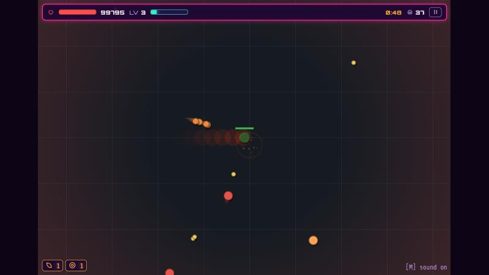
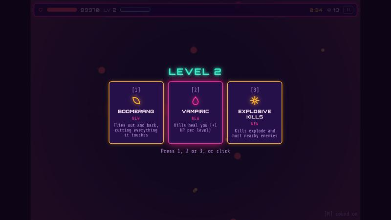

# arrow-game

A browser archer roguelite in the style of Archero and arrow.io. You steer a lone archer through swarms of enemies, collect gems, and build a run out of upgrade cards. It is strict TypeScript bundled by Vite, with Bun for tooling (install, scripts, tests). The game simulation is deterministic and runs on typed arrays, rendering is WebGL2 with a Canvas2D fallback, and there are no runtime dependencies.




**Live demo:** <!-- TODO: live demo link once deployed -->

## How to play

Pick a mode on the title screen.

- **Arena**: endless survival. Enemies keep coming and get tougher (shooters, swarmers, bruisers, splitters, bosses); last as long as you can. Killed enemies drop gems, and collecting enough of them levels you up.
- **Rooms**: clear one room of enemies at a time. Clearing a room offers a card, restores 15 HP and moves you to the next room; every 10th room has a boss.

Controls:

- **Move**: WASD or the arrow keys. On touch screens, drag anywhere to get a virtual stick.
- **Shooting is automatic**: the archer fires at the nearest enemy in range. In Arena it keeps firing while you move, at half rate; in Rooms it only fires while standing still.
- **Level-up**: the game pauses and offers 3 cards. Press **1**, **2** or **3**, or click a card. Arena also offers weapons and modifiers (see Features).
- **Pause**: **Esc** or **P** (the game also pauses when the tab loses focus). **M** mutes sound.

Challenges (title screen): play a Daily Arena or Daily Rooms run (the seed comes from the date), or type any text or number as a seed. If you have a previous best on that seed, it races you as a translucent ghost with a live comparison. Finished runs can be watched back as replays (1x or 4x) and shared as a code that others can import.

## Quick start

Requires [Bun](https://bun.sh). Node is only used for an optional cross-engine test run.

```sh
bun install          # dev dependencies only
bun run dev          # Vite dev server on http://localhost:8000
bun run build        # production bundle in dist/
bun test             # the full test suite (366 tests)
node --test test/*.test.ts   # same tests on Node/V8, a cross-engine check of the golden hashes
bun run typecheck    # tsc --noEmit
```

To host from a subpath such as GitHub Pages, set `BASE_PATH`:

```sh
BASE_PATH=/arrow-game/ bun run build
```

In Git Bash on Windows, set `MSYS_NO_PATHCONV=1` first (or use PowerShell), because Git Bash rewrites an environment value that starts with a slash.

## Features

- **Weapons** (Arena, levels 1 to 5, up to four held at once alongside the bow): Orbit Blade, Shockwave, Chain Lightning, Boomerang, Flame trail, Mines, Meteor, Beam and Drone; the bow with its Multishot, Piercing, Ricochet and Homing upgrades.
- **Modifiers** (Arena, levels 1 to 5): Crit, Knockback, Vampiric, Explosive, Frost and Ignite.
- **Deterministic replays**: every run is its seed plus quantized inputs and picks, so it can be re-simulated exactly and verified (`SIM_VERSION` 10).
- **Daily challenges, ghosts and share codes**, as described above.
- **Rendering and polish**: WebGL2 renderer with a Canvas2D fallback (`?renderer=canvas2d`), motion trails, screen shake and hit effects, and WebAudio-synthesized sound with no audio files.

## Development notes

Build sizes, benchmarks, soak-test results, design notes, versioning rules and known gaps are in [docs/DEVELOPMENT.md](docs/DEVELOPMENT.md). Design specs are kept out of the published tree.

## AI-assisted development

This project was built with Claude Code as a pair programmer. Each feature went through a spec, then a plan, then implementation by subagents with review gates between steps. The specs and plans are not part of the published tree. Tests and determinism checks (golden replay hashes, run on both Bun and Node) gate every change, so a change that alters simulation behaviour has to bump `SIM_VERSION` explicitly.

## License

MIT, see [LICENSE](LICENSE). Bundled fonts (Orbitron, Share Tech Mono) are SIL OFL 1.1; licences in `assets/fonts/`.
